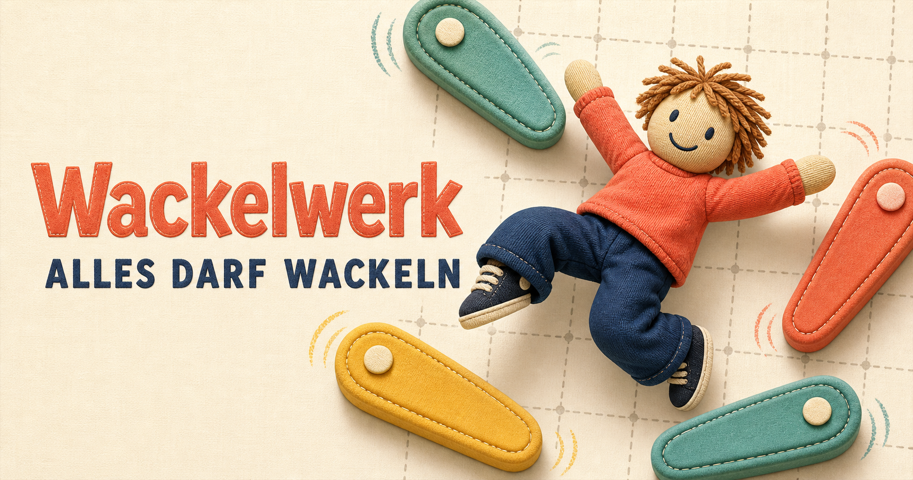
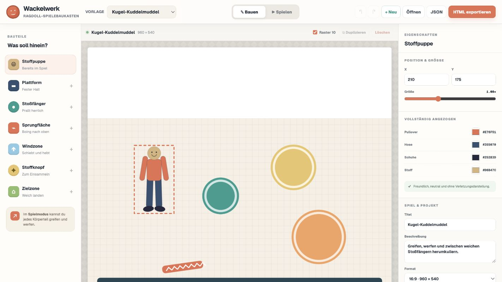
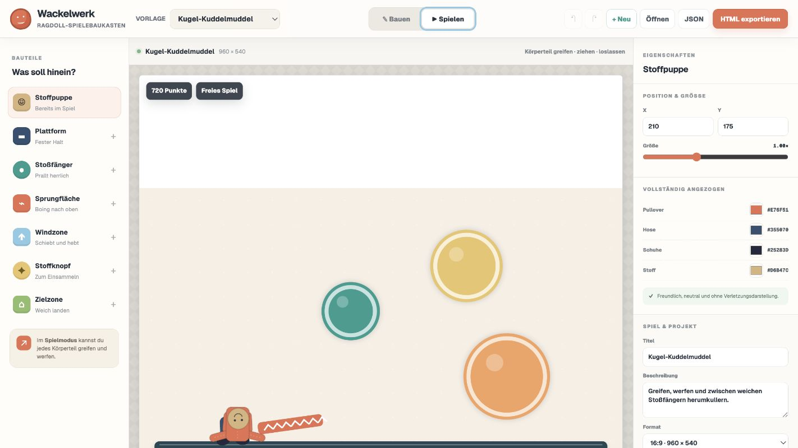

# Wackelwerk



[](https://github.com/derpaile/wackelwerk/actions/workflows/ci.yml)


**Wackelwerk ist ein visueller Baukasten für kleine, lustige Ragdoll-Browserspiele.** Bauteile platzieren, Regeln festlegen, sofort spielen und das Ergebnis als eigenständige HTML-Datei exportieren – ohne Programmierung.

Die Figur ist bewusst als freundliche, geschlechtsneutrale und vollständig angezogene Stoffpuppe gestaltet. Wackelwerk enthält weder sexualisierte Darstellung noch Verletzungen oder Blut.

## Screenshots

### Spiele visuell bauen



### Sofort ausprobieren



## Was bereits funktioniert

- visueller Editor mit Objektpalette und Eigenschaften
- Stoffpuppe mit zehn Physikkörpern und Gelenken
- Plattformen, Stoßfänger, Sprungflächen, Windzonen, Knöpfe und Zielzonen
- Verschieben, Drehen, Skalieren, Duplizieren und Löschen
- Rasterfang sowie Rückgängig/Wiederholen
- Treffer-, Sammel-, Zielzonen- und Zeitziele
- drei fertige Vorlagen: Kugel-Kuddelmuddel, Knopf-Slalom und Sofalandung
- Maus- und Touch-Steuerung im Spiel
- Punkte, Pause, Neustart, Ton und reduzierte Bewegung
- automatische lokale Speicherung
- validierter JSON-Import/-Export
- vollständig eigenständiger HTML-Export ohne CDN oder Server
- responsive Spielansicht für Desktop und Mobilgeräte

## Schnellstart

Voraussetzung: Node.js `>=22.13.0`.

```bash
git clone https://github.com/derpaile/wackelwerk.git
cd wackelwerk
npm install
npm run dev
```

Danach läuft der Editor unter [http://localhost:3000](http://localhost:3000).

## Befehle

| Befehl | Zweck |
| --- | --- |
| `npm run dev` | lokale Entwicklung mit Live-Aktualisierung |
| `npm run build` | produktionsfähigen Cloudflare-Worker bauen |
| `npm test` | Build, Typprüfung und alle Tests ausführen |
| `npm run lint` | Quelltext statisch prüfen |

## Bedienung

1. Eine Vorlage auswählen oder mit **Neu** starten.
2. Links Bauteile hinzufügen und auf der Spielfläche anordnen.
3. Rechts Farben, Maße, Physik und Ziele einstellen.
4. Zu **Spielen** wechseln und einzelne Körperteile greifen, ziehen und loslassen.
5. Das Projekt als JSON sichern oder als eigenständige HTML-Datei exportieren.

Der HTML-Export bettet Spieldefinition, Physik-Engine, Darstellung und Steuerung in eine einzige Datei ein. Das fertige Spiel kann offline geöffnet oder auf jedem statischen Webspace veröffentlicht werden.

## Architektur

```text
app/                 Editor, Spielansicht und Oberfläche
lib/game.ts          versioniertes Schema, Validierung und Vorlagen
lib/runtime.ts       Matter.js-Physik und Canvas-Darstellung
lib/exporter.ts      JSON- und HTML-Download
lib/export-core.ts   sicherer eigenständiger HTML-Export
lib/standalone-*.js  eingebettete Offline-Laufzeit
tests/               Schema-, Export- und Renderprüfungen
worker/              Cloudflare-Worker-Einstieg
```

Die öffentliche Spieldefinition verwendet `schemaVersion: 1`. Entitäten besitzen stabile IDs; Ziele referenzieren ausschließlich diese IDs. Importierte Dateien werden vollständig geprüft, bevor sie das aktuelle Projekt ersetzen.

## Technik

- React 19 und TypeScript im Strict-Modus
- [vinext](https://github.com/cloudflare/vinext) und Vite
- [Matter.js](https://brm.io/matter-js/) für Körper, Gelenke und Kollisionen
- Canvas 2D für die vom Physikkern getrennte Darstellung
- Cloudflare-Worker-kompatibler Produktions-Build
- Node Test Runner für automatisierte Prüfungen

Die Simulation arbeitet mit einem festen 60-Hz-Schritt. Größenänderungen skalieren nur die Kamera, nicht die Physikwelt. Sicherheitsgrenzen, Geschwindigkeitsbegrenzung und Reset-Logik halten die Stoffpuppe stabil im Spiel.

## Beitragen

Fehlerberichte und Ideen sind willkommen. Vor einem Pull Request bitte ausführen:

```bash
npm test
npm run lint
```

## Status

Wackelwerk ist eine frühe, spielbare Version. Eine Lizenz ist noch nicht festgelegt; bis dahin bleiben alle Rechte beim Projektinhaber.
